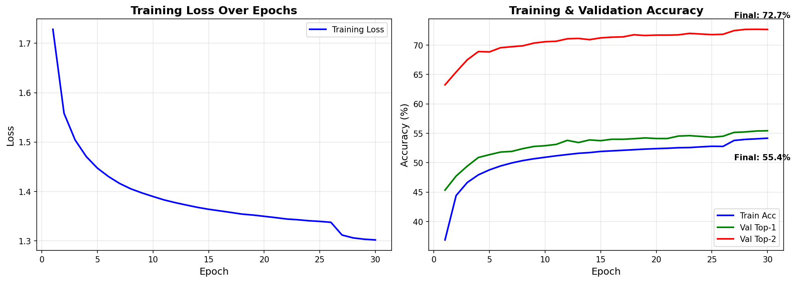

# 🚀 Final Experiment & Evaluation Results

## 🏆 Executive Summary (Test Set)

Our Optimized MLP with token-wise data split achieves **4.5x better performance** than random guessing.

| Model Strategy | Test Top-1 | **Improvement** | Test Top-2 | **Improvement** |
| :--- | :---: | :--- | :---: | :--- |
| **Random Baseline** | 12.50% | *(Reference)* | 25.00% | *(Reference)* |
| **Lookup Rules** (Best L5) | 42.17% | +237% (3.4x) | 56.15% | +125% (2.2x) |
| **XGBoost** | 36.16% | +189% (2.9x) | 53.26% | +113% (2.1x) |
| **Neural Network (MLP)** | **55.60%** | **+345% (4.5x)** 🚀 | **73.24%** | **+193% (2.9x)** 🚀 |

### 💡 Key Insights
1. **Massive Lift**: The Neural Network provides a **4.5x improvement** over random chance
2. **SOTA vs Rules**: Neural Networks beat simple memorization by **+13.4%** absolute accuracy
3. **Top-2 Critical**: With 73.2% Top-2 accuracy, speculating 2 experts ahead is correct nearly 3/4 of the time

## 📈 Training Curves

## 📊 Methodology Notes

- **Data Split**: Token-wise 98/1/1 split (1.35M train, 13.7K val, 13.7K test samples)
- **Training**: 30 epochs, Bayesian-optimized hyperparameters
- **Validation**: Used for MLP/XGBoost to tune hyperparameters
- **Test**: All models evaluated on the same held-out test set
- **Baseline**: Random = 1/8 experts (12.5% Top-1, 25% Top-2)
